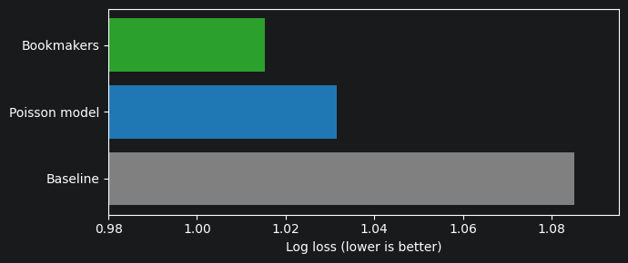
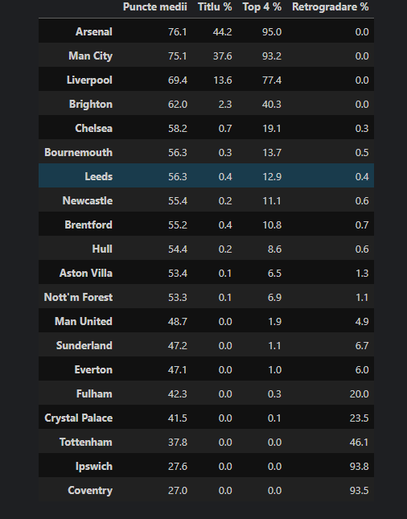

# Premier League Match Predictor ⚽

Predicting the outcome of every remaining Premier League 2026/27 match with a Poisson regression model, and simulating the rest of the season 10,000 times to estimate each team's chances of winning the title, finishing top 4, or getting relegated.

## Results

### Model evaluation (2025/26 season, 380 matches)

The model was trained only on the 2023/24 and 2024/25 seasons and then used to predict every match of 2025/26, which it had never seen.

| Model | Log loss ↓ | Accuracy ↑ |
|---|---|---|
| Baseline (historical H/D/A frequencies, always predict home win) | 1.0852 | 42.6% |
| **My Poisson model (alpha = 0.01)** | **1.0315** | **47.6%** |
| Bookmakers (market average odds, margin removed) | 1.0153 | 49.5% |

The model clearly beats the baseline and gets close to the bookmakers, despite using only past scores and never being updated during the season (bookmakers update their odds every week and include information like injuries and line-ups).



### Season simulation (as of 20 September 2026, after matchweek 5)

10,000 Monte Carlo simulations of the remaining matches:

da


## Data

Match results and betting odds from [football-data.co.uk](https://www.football-data.co.uk/englandm.php), Premier League seasons 2016/17 to 2026/27. The notebook downloads the data directly, so no CSV files are stored in this repository.

## Method

1. **Poisson regression.** The number of goals a team scores is modelled as a Poisson distribution depending on three things: the team's attacking strength, the opponent's defensive strength, and home advantage. The model is trained with scikit-learn's `PoissonRegressor` on one-hot encoded teams.
2. **Match probabilities.** From the expected goals of both teams, the model computes the probability of every scoreline (0-0, 1-0, 2-1, ...) and sums them into home win / draw / away win probabilities.
3. **Hyperparameter tuning.** The regularization strength `alpha` was chosen by training on past seasons and comparing log loss on 2025/26 for several values (0.001 to 0.1).
4. **Monte Carlo simulation.** Scores for all remaining matches are sampled from the Poisson distributions 10,000 times. Each simulated season produces a final table (points, then goal difference), and the probabilities are the share of simulations in which each outcome happens.

## Problems I found and fixed

**Home advantage was ignored.** When I compared Liverpool at home and away against the same opponent, the probabilities were exact mirror images, which shouldn't happen. The home advantage coefficient turned out to be exactly 0, even though home teams score more on average (1.52 vs 1.32 goals). The cause was the statsmodels formula interface not building the `home` column correctly on my setup. I rebuilt the design matrix explicitly and switched to scikit-learn, and the coefficient became about 0.14, matching ln(1.52 / 1.32).

**Overfitting on promoted teams.** The first simulation had newly promoted Hull as the third favourite for the title and Coventry finishing with 6.7 points, both unrealistic. Both teams had only 5 matches in the data, and with almost no regularization the model trusted those 5 matches completely. Increasing `alpha` shrinks teams with little data towards an average team, which fixed the problem.

**Choosing alpha.** The evaluation showed that small values (0.001 to 0.01) work best on full seasons, while 0.05 and above pull strong and weak teams too close together. I chose 0.01 as a compromise: almost as good as the best value in the evaluation, but with enough regularization to keep promoted teams realistic early in the season.

## Limitations

- Team strength is assumed constant for the rest of the season. Transfers, injuries and managerial changes are not taken into account.
- The simulation treats estimated team strengths as exact, so extreme probabilities (e.g. over 90% relegation chance after a few matches) are probably overconfident.
- Promoted teams have very little Premier League data, so their predictions are the least reliable.
- Draws are almost never the most likely outcome, so the model rarely "predicts" a draw even though about a quarter of matches end level.

## How to run

```bash
pip install -r requirements.txt
jupyter notebook main.ipynb
```

Run all cells. The data is downloaded automatically, and results change every week as new matches are played.

## Possible next steps

- Weight recent matches more heavily than older ones
- Add expected goals (xG) data from Understat
- Compare with a classifier (Random Forest / XGBoost) using recent form features
- Update the model automatically after every matchweek